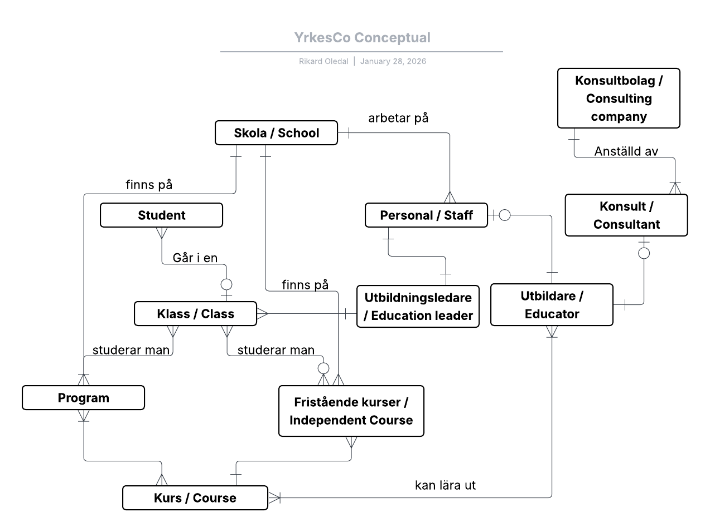
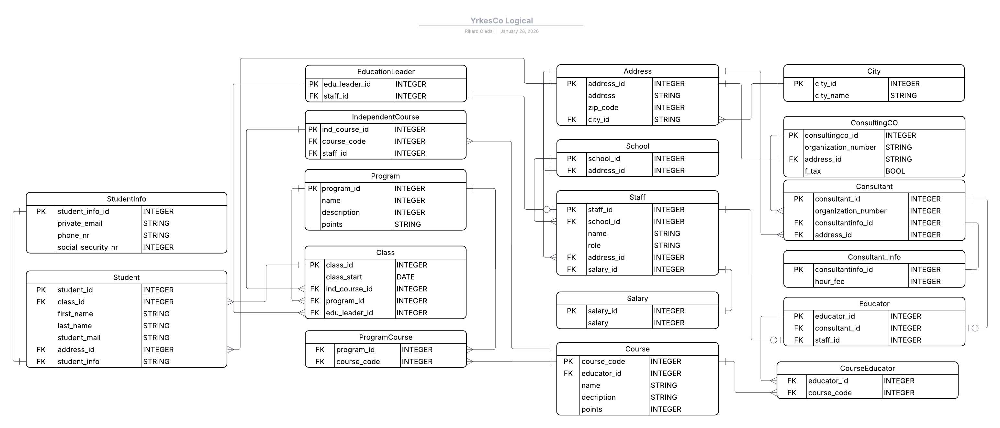
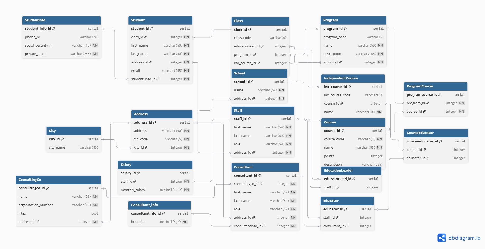

# Lab - Data Modelling

Uppgiften i denna lab var att skapa modeller för en databas för Yrkeshögskolans YrkesCo. Det ska ingå en Konceptuell, en Logisk och en Fysisk modell. Efter det ska jag skapa databasen och visa att den fungerar. Modellen ska vara 3NF.

Jag skulle även spela in en video pitch där jag förklarar modellerna och ordna en pdf som förklarar modellerna. För mer info om labben se nedan PDF.

[Lab_instruktioner (PDF)](./img/lab_yrkesco.pdf)


## Video

<a href="https://www.youtube.com/watch?v=sb5SrouAKeg">
  
</a>

[PDF till videon](./img/YrkesCoPDF.pdf)


## Installation
1. Klona repro
    ```bash
    git clone https://github.com/RikardOledal/DataModelling_DE25_LAB_Rikard_Oledal.git
    ```

2. Starta en Container
    ```bash
    docker compose up -d
    ```

3. Starta Bash i containern
    ```bash
    docker exec -it yrkesco bash
    ```

4. Skapa databasen
    ```bash
    psql -U postgres -d yrkco_db -f 01_DDL.sql
    ```

5. Skapa fakedata
    ```bash
    psql -U postgres -d yrkco_db -f 02_fakedata.sql
    ```

6. Checka att datan har kommit in
    ```bash
    psql -U postgres -d yrkco_db -f 03_querry_check.sql
    ```

7. Gå in i databasen på Containern
    ```bash
    psql -U postgres -d yrkco_db
    ```

## Konceptuell Modell
I den konceptuella modellen så tänkte jag att alla elever går i en Klass. Klasser är knuten till ett Program eller en Fristående Kurs som är knuten till en skola. I Program och Fristående kurser finns kurser. Utbildare är knutna till Kurserna och Utbildare kan vara personal eller konsulter. Se denna länk för mer [Relationship statements](./yh_labb/models/statments.md)




## Logisk Modell
I den logiska modellen skapade jag fler entiteter för att man ska kunna sätta restriktioner på entiteter som har känsliga uppgifter så som lön eller personnummer. Efter som den Logiska Modellen inte ska ha Many2Many-relation mellan entiteterna så blev det också en del bryggor för att hantera detta. För att uppnå 3NF bröt jag även ut City ur Address-entiteten för att säkerställa att vi att varje icke-nyckel-attribut i Address-tabellen beror på nothing but the key. Därmed har jag tagit bort det transitiva beroendet mellan adress-id och stadens namn.




## Fysisk Modell
I den fysiska modellen har jag med alla Entiteter med Attribut och Datatyper. För alla id så använde jag SERIAL som gör att man inte behöver fylla i den kolumnen utan det tar databasen hand om. Jag använde RegEx i kombination med VARCHAR för bestämma där det skulle vara en viss längd på siffror. Jag gjorde även Table-check på t.ex. Utbildare för att se till att den bara kunde vara antingen Konsult eller Fast anställd, men inte både och.



## Hjälp
Jag har en studiegrupp med Anja Scherwall och Felix Kjellberg. Vi har diskuterat många av modellerna för att se om de håller och få nya idéer.
Jag har även bollat med Google Gemini vid behov.
